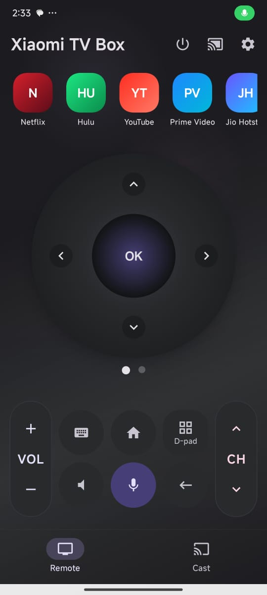
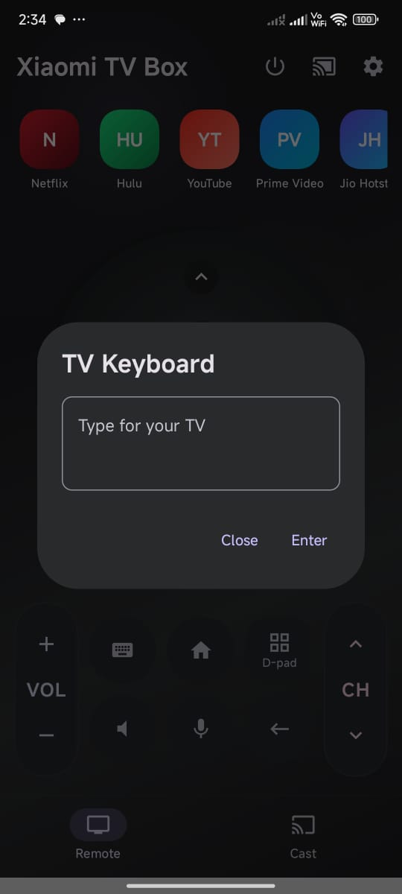
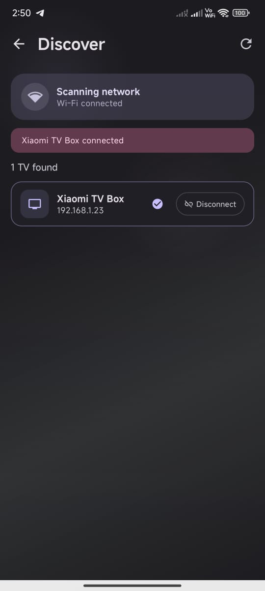

# TV Remote for Android TV

[](https://github.com/harimoradiya/TV-Remote-for-Android-TV/actions/workflows/android.yml)
[](https://opensource.org/licenses/Apache-2.0)
[]()
[]()

A fast, privacy-focused, and completely free Android TV remote control app that lets users control Android TV and compatible Smart TVs over the same Wi-Fi network.

No ads. No subscriptions. No premium locks. Just a simple and reliable TV remote experience.

---

## Why I Built This

I built TV Remote for Android TV to make everyday TV control simpler when a physical remote is missing, out of battery, or inconvenient to use. My goal is to provide a fast, clean, and reliable remote experience without advertisements, subscriptions, or feature restrictions.

This project is designed for people who want a practical TV remote that respects their time and privacy.

---

## Feel the Remote

TV Remote for Android TV is designed to feel familiar from the first tap. The interface focuses on the controls people use most: navigation, select, back, home, volume, power, and keyboard input.

The goal is simple: pick up your phone, connect to your TV, and control it naturally.

---

## Features

- **Local Network Auto-Discovery**: Automatic discovery of compatible Android TVs on the same local Wi-Fi network using **ConnectSDK** (Chromecast, Cast services).
- **Smooth Navigation**: D-pad control and gesture touchpad controls.
- **Universal Input controls**: Select, Back, Home, and TV Menu buttons.
- **Volume and Power Controls**: Control your TV volume and trigger power-off/standby (on supported TVs).
- **IME Keyboard Sync**: Sync typing from your mobile device directly to your Android TV search fields and text boxes.
- **Customizable App Strip**: Reorder quick-launch applications shown at the top strip of the remote (fully unlocked for all users).
- **Appearance Customization**: Dynamically extract wallpaper colors (Material You) and customize basic color themes.
- **Zero Monetization**: Free of AdMob SDK, billing client integrations, tracking libraries, and paywalls.

---

## Screenshots

<p align="center">
  
  
  
</p>

---

## Technology Stack

- **Kotlin**: Language of choice for clean, modern Android development.
- **Jetpack Compose**: Modern declarative toolkit for building high-performance UIs.
- **Material Design 3**: Google's latest design system for fluid, responsive components and colors.
- **Coroutines & Flow**: Async programming and reactive data streams.
- **Jetpack DataStore**: Safe, async preference storage.
- **ConnectSDK**: Service discovery library supporting Chromecast/Cast protocol.
- **Protobuf**: Android TV pairing and messaging protocol parsing.
- **BouncyCastle**: Encryption provider for SSL/TLS pairing certificates.
- **Java-WebSocket**: Communication layer for remote commands.
- **Retrofit & OkHttp**: Rest client for APIs and backend configurations.
- **NanoHTTPD**: Lightweight embedded HTTP server to support media casting.

---

## Architecture Overview

The project uses clean architectural design patterns with structured separation of concerns:
- **UI & Presentation**: Jetpack Compose screens and themes. State management is driven by a single unified `TvRemoteViewModel` exposed as `StateFlow`.
- **Navigation**: Structured graph defined in `AppNavGraph.kt`.
- **Low-Level Android TV Lib**: Lower-level pairing, certificate generation, connection handshake, and protocol message delivery are managed cleanly in `androidLib/`.
- **Services**: `CastService` and `KeepAliveService` ensure background connection stability and notifications are handled cleanly without memory leaks.

---

## Requirements

- Android SDK version 24 (Android 7.0) or higher.
- Java Development Kit (JDK) 17.
- A physical Android TV or Android TV emulator.
- Both devices (Phone and TV) must be connected to the exact same Wi-Fi subnet.

---

## Installation and Build Instructions

To build the project yourself:

1. Clone the repository:
   ```bash
   git clone https://github.com/harimoradiya/TV-Remote-for-Android-TV.git
   cd TV-Remote-for-Android-TV
   ```
2. Open the project in **Android Studio**.
3. Generate a mock `google-services.json` or place your own inside the `app/` directory (required by the Firebase plugin). A dummy format:
   ```json
   {
     "project_info": { "project_number": "123", "project_id": "mock-id", "storage_bucket": "mock.appspot.com" },
     "client": [{ "client_info": { "mobilesdk_app_id": "1:123:android:123", "android_client_info": { "package_name": "com.hari.androidtvremote" } }, "api_key": [{ "current_key": "mock" }], "services": {} }],
     "configuration_version": "1"
   }
   ```
4. Build the debug APK via Gradle:
   ```bash
   ./gradlew assembleDebug
   ```
5. Deploy to your connected device/emulator.

---

## How to Connect to an Android TV

1. Ensure your phone's Wi-Fi is enabled and connected to the same network as your TV.
2. Open **TV Remote for Android TV**.
3. Tap on the **Cast/Discover** icon in the top right.
4. Select your Android TV from the discovered device list.
5. If pairing for the first time, a pairing code will appear on the TV screen. Enter it in the app's pairing dialog to establish a secure SSL/TLS connection.
6. Once connected, use the remote pad, touchpad, volume keys, and keyboard!

---

## Project Structure

```text
app/
  src/main/java/com/hari/androidtvremote/
    androidLib/       # Lower-level TV pairing protocol & SSL handshakes
    navigation/       # AppNavGraph and screen routing definitions
    preference/       # Material You theme preference DataStore
    services/         # Foreground Services (CastService, KeepAliveService)
    ui/               # UI Layer (Screens, Theme, ViewModel)
    utils/            # Logging, Analytics, Web Server, and constants
  src/main/res/       # Vector drawables, strings, and app configurations
docs/
  images/             # App screenshots
.github/
  workflows/
    android.yml       # GitHub Actions Continuous Integration (CI)
README.md
LICENSE
CONTRIBUTING.md
CODE_OF_CONDUCT.md
SECURITY.md
CHANGELOG.md
.gitignore
```

---

## Privacy and Security

- **No Data Harvesting**: The app operates locally. No private data, IP addresses, TV identifiers, or keystores are uploaded to external servers.
- **No Monetization Identifiers**: We have removed all ad-tracking tags and identifiers.
- **Secure Transport**: Pairing and remote messaging occur over encrypted SSL sockets.

---

## Open-Source Contributions

We welcome forks and pull requests! Please read our [CONTRIBUTING.md](CONTRIBUTING.md) and respect the [CODE_OF_CONDUCT.md](CODE_OF_CONDUCT.md).

Do **not** commit credentials, signing assets, or production configuration variables in pull requests.

---

## Roadmap

- [ ] Support gesture swipe zones in the touchpad mode.
- [ ] Add quick-settings tile support to lock/unlock TV from the notification drawer.
- [ ] Enhance TV auto-reconnect flow after network wake events.

---

## Support / Optional Donations

Optional donations to the developer, Hari Moradiya, help support ongoing maintenance and new features. Donations are fully voluntary and **never** unlock extra functionality. Every feature in this application remains 100% free and open to everyone.

---

## Disclaimer

This application is an independent project and is not affiliated with, endorsed by, or sponsored by Google LLC, Android TV, Google TV, or any television manufacturer.

---

## License

This project is licensed under the Apache License 2.0. See the [LICENSE](LICENSE) file for details.

---

## Author and Contact

**Hari Moradiya**  
Email: harimoradiya123@gmail.com  
GitHub: [harimoradiya](https://github.com/harimoradiya)
